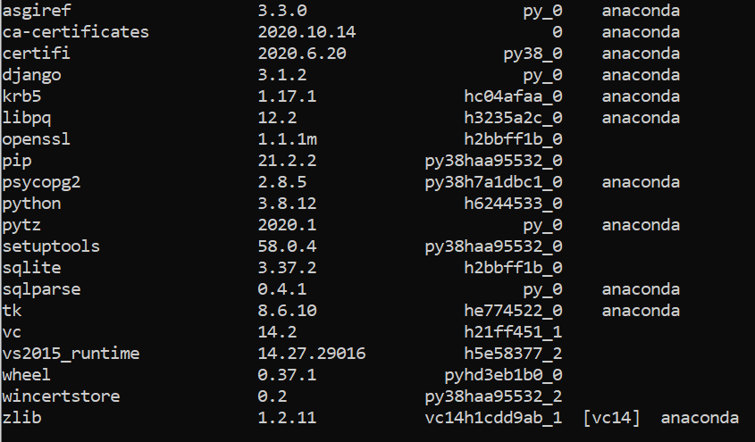

With this code base you can locally host the django project or host it online at a given domain or a website such as python anywhere for wide access of the system.  When hosted at a specific domain it will be accessible at "domain\textbackslash display". When hosted online for security requirements it must be accessible with HTTPS.

For hosting the system locally it will require anaconda and an anaconda environment containing the Django library. To do this open  the anaconda console and use the command: "conda create --name myenv python=3.8.12". Type y when requested to proceed. Use the command: "conda install -n myenv pip" to install pip within the environment. Use the command "conda activate myenv" to use the environment. From within the environment install the required packages as seen in the image bellow to the versions specified.

From here with the environment activated navigate to the directory you wish to store the project and clone it from the github repository or navigate to the location it is stored at. Once in the directory navigate to "\textbackslash PedalPower\textbackslash pedalpower" and use the command: "python manage.py runserver". This will run the project on the localhost and will be accessible at \url{http://127.0.0.1:8000/display}.

Once in the system the row of buttons along the top of the screen allow for connecting of up to two bikes and to provide connection details, forced re-connection and disconnection. All outputs from such buttons can be viewed in the browsers output console. If using windows 10 on wards ensure the device is using Bluetooth 5 or above. If on Linux and earlier versions of Windows OS, enable the \#experimental-web-platform-features flag in about://flags to ensure the Web Bluetooth API works. The API is not fully compatible with all browsers, it is recommended to use google chrome, however, it should work with edge and opera as well.

Once both bikes have been connected use the "Hide menu \& go full screen" button. This will hide these administrative buttons and launch the display into full screen. From here the display is good to be used and when needing to be closed exit the full screen.
